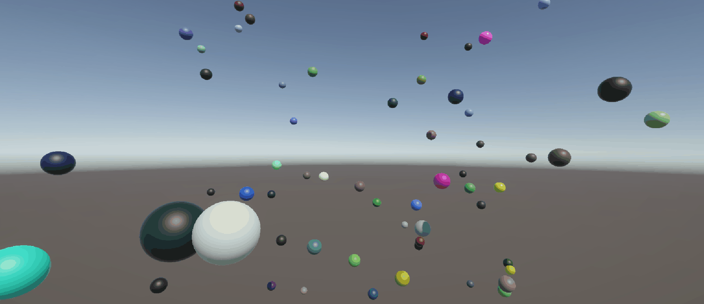
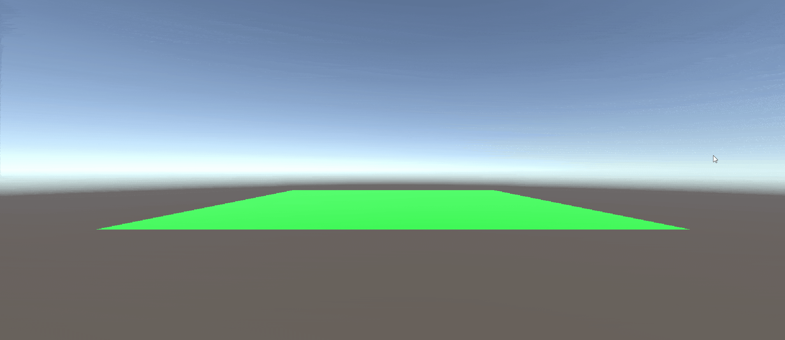
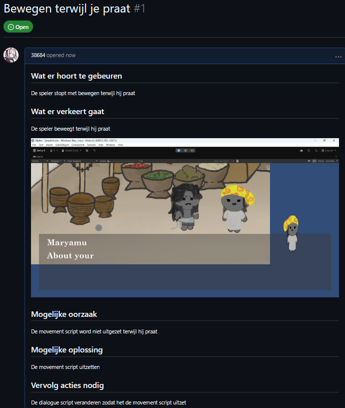
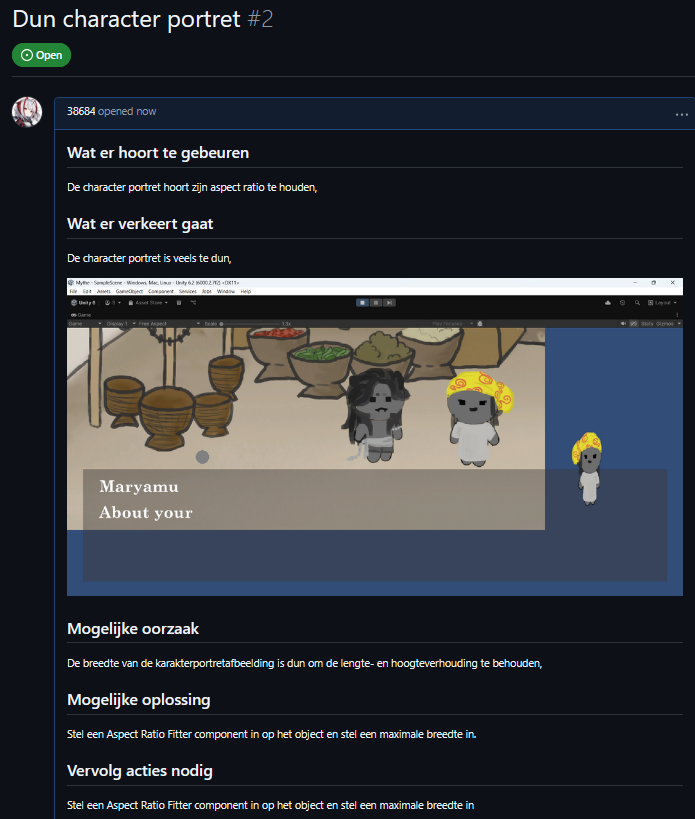
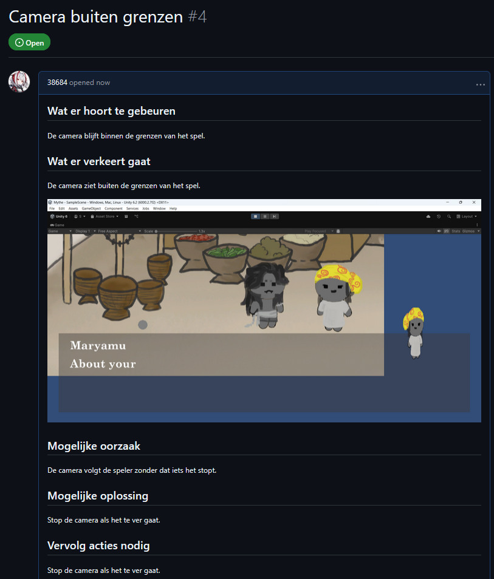
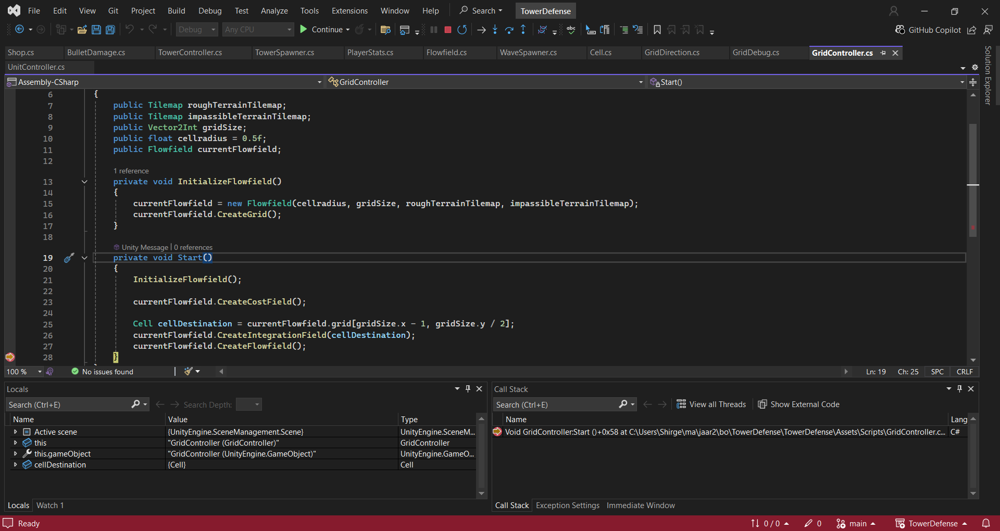
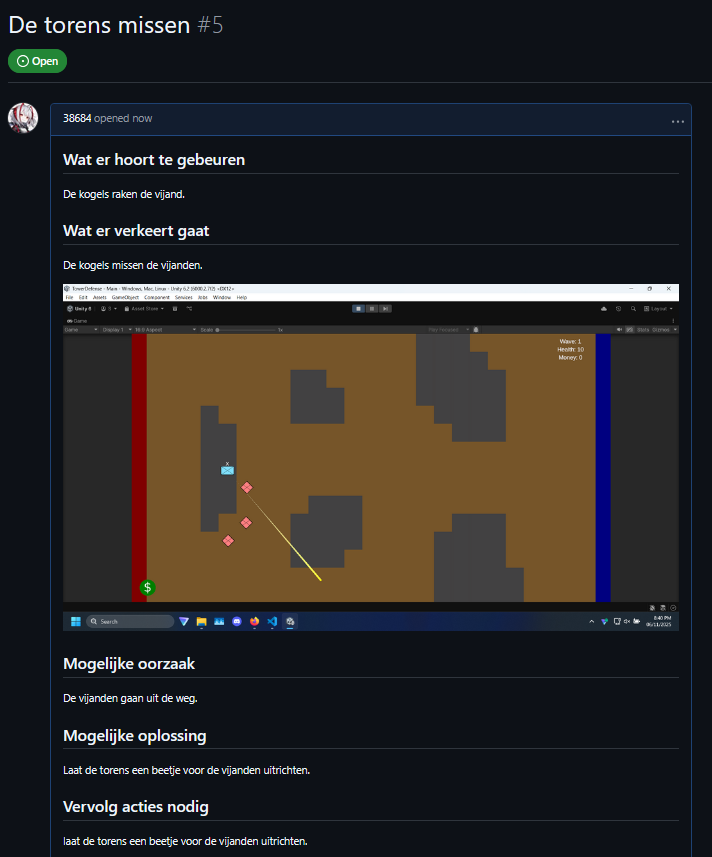

# M5Prog

## PROG les 1: Herhaling Functions, Classes en Arrays

### Opdracht 1 Functions, Methods, Parameters & return type

Ik heb een Functions, Methods, Parameters & return type gebruikt.

[CreateBall Script](M5Prog/Assets/Scripts/01_Herhaling_Functions_Classes_Arrays/Ball.cs)

### Opdracht 2 Class, Object, Constructor & Instantiate

Ik heb Class, Object, Constructor en Instantiate gebruikt.

[Game Script](M5Prog/Assets/Scripts/01_Herhaling_Functions_Classes_Arrays/Gvame.cs)

### Opdracht 3 List en loop

Ik heb Lists en loops gebruikt.

[Enemy Spawner Script](M5Prog/Assets/Scripts/01_Herhaling_Functions_Classes_Arrays/EnemySpawner.cs) \
[Enemy Controller Script](M5Prog/Assets/Scripts/01_Herhaling_Functions_Classes_Arrays/EnemyController.cs)

## PROG les 2: Action Events

### Opdracht 4: Action Events

Ik heb Action Events gebruikt.

[Player Movement Script](M5Prog/Assets/Scripts/02_Action_Events/PlayerController.cs) \
[Pickup Script](M5Prog/Assets/Scripts/02_Action_Events/Pickup.cs) \
[Scoreboard Script](M5Prog/Assets/Scripts/02_Action_Events/ScoreBoard.cs)

## PROG les 3: Debugging

### Opdracht 5A : Wat veroorzaakt de bugs?

#### De Enemy schiet nooit

delta.magnitude is altijd &gt; shotRange omdat shotRange gelijk aan 0 is.

#### Het schot raakt de speler niet

targetTag is verkeerd getypt en gebruikt voordat de CallShot functie het kan veranderen met _targetTag

### Opdracht 5B : Vastleggen van Mythe bugs

 \
 \

### Opdracht 5C : Breakpoints

### Opdracht 5D : Bijhouden bugs voor Towerdefense

## PROG les 4: Single Responsibility (SRP) en Don't Repeat Yourself (DRY)

### Opdracht 6: SRP

Ik heb de schip script opgesplit.

[Github Link](https://github.com/38684/Space48)

### Opdracht 7: DRY

Ik heb de movement scripts gecombineerd en de message scripts gecombineerd.

[Github Link](https://github.com/38684/Space48)

## PROG les 5: OOP Inheritance

### Opdracht 8: Inheritance

Ik heb inheritance gebruikt.

[Shoot From Camera Script](M5Prog/Assets/Scripts/05_OOP_Inherritance/ShootFromCamera.cs) \
[Projectile Script](M5Prog/Assets/Scripts/05_OOP_Inherritance/Projectile.cs) \
[Enemy Parent Script](M5Prog/Assets/Scripts/05_OOP_Inherritance/EnemyParent.cs) \
[Brute Script](M5Prog/Assets/Scripts/05_OOP_Inherritance/Brute.cs) \
[Elf Script](M5Prog/Assets/Scripts/05_OOP_Inherritance/Elf.cs)

### Opdracht 9, Encapsulation

Ik heb elke variable een voor een alle encapsulation veranderd

[PDF Link](Dependencies.pdf)

# M6Prog

