<details>

<summary>M5Prog</summary>

## PROG les 1: Herhaling Functions, Classes en Arrays

### Opdracht 1 Functions, Methods, Parameters & return type

Ik heb een Functions, Methods, Parameters & return type gebruikt.

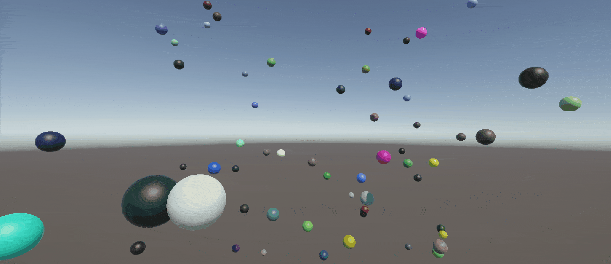

[CreateBall Script](Prog/Assets/Scripts/M5Prog/01_Herhaling_Functions_Classes_Arrays/Ball.cs)

### Opdracht 2 Class, Object, Constructor & Instantiate

Ik heb Class, Object, Constructor en Instantiate gebruikt.

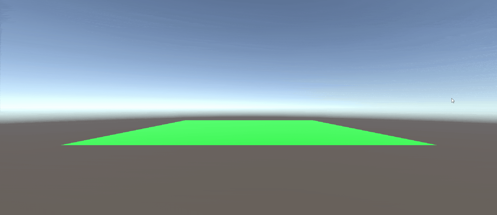

[Game Script](Prog/Assets/Scripts/M5Prog/01_Herhaling_Functions_Classes_Arrays/Gvame.cs)

### Opdracht 3 List en loop

Ik heb Lists en loops gebruikt.


[Enemy Spawner Script](Prog/Assets/Scripts/M5Prog/01_Herhaling_Functions_Classes_Arrays/EnemySpawner.cs) \
[Enemy Controller Script](Prog/Assets/Scripts/M5Prog/01_Herhaling_Functions_Classes_Arrays/EnemyController.cs)

## PROG les 2: Action Events

### Opdracht 4: Action Events

Ik heb Action Events gebruikt.


[Player Movement Script](Prog/Assets/Scripts/M5Prog/02_Action_Events/PlayerController.cs) \
[Pickup Script](Prog/Assets/Scripts/M5Prog/02_Action_Events/Pickup.cs) \
[Scoreboard Script](Prog/Assets/Scripts/M5Prog/02_Action_Events/ScoreBoard.cs)

## PROG les 3: Debugging

### Opdracht 5A : Wat veroorzaakt de bugs?

#### De Enemy schiet nooit

delta.magnitude is altijd &gt shotRange omdat shotRange gelijk aan 0 is.

#### Het schot raakt de speler niet

targetTag is verkeerd getypt en gebruikt voordat de CallShot functie het kan veranderen met _targetTag

### Opdracht 5B : Vastleggen van Mythe bugs

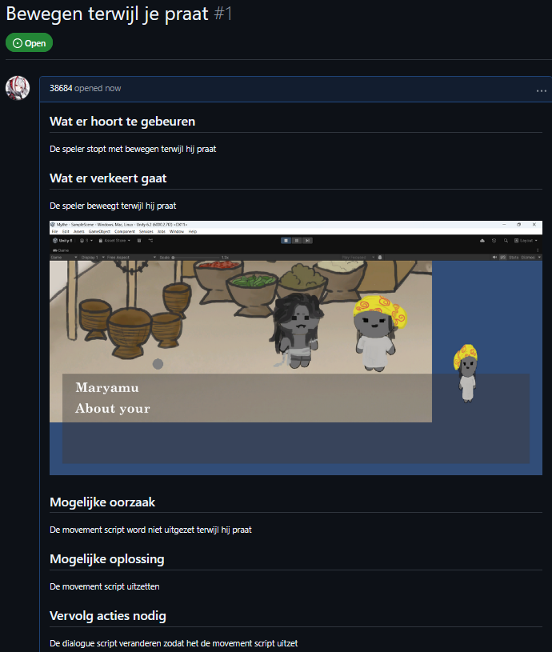 \
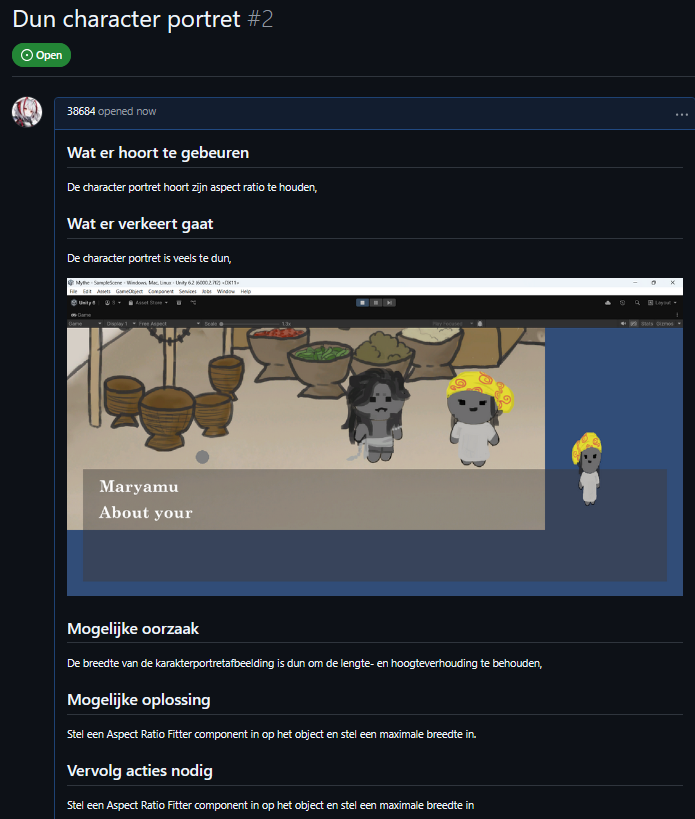 \
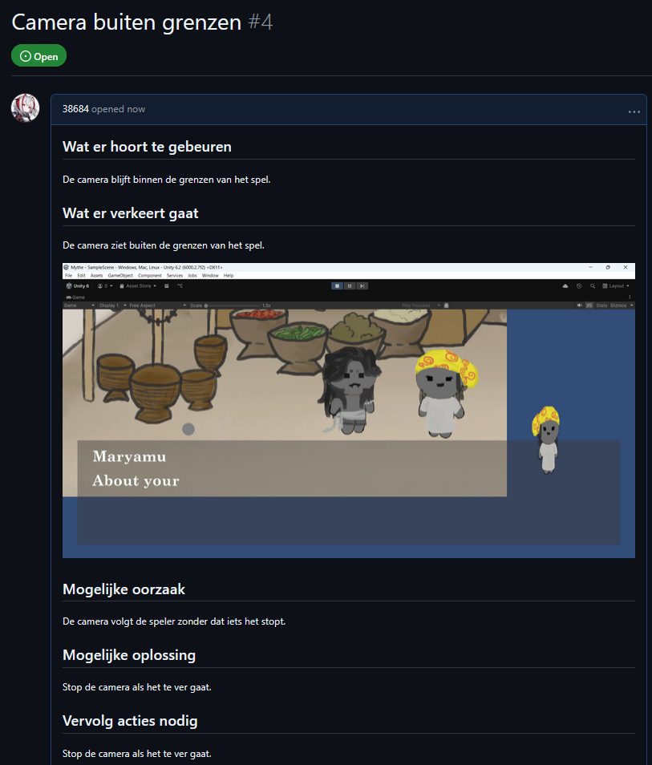

### Opdracht 5C : Breakpoints

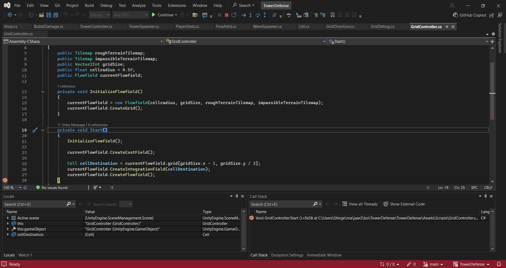

### Opdracht 5D : Bijhouden bugs voor Towerdefense

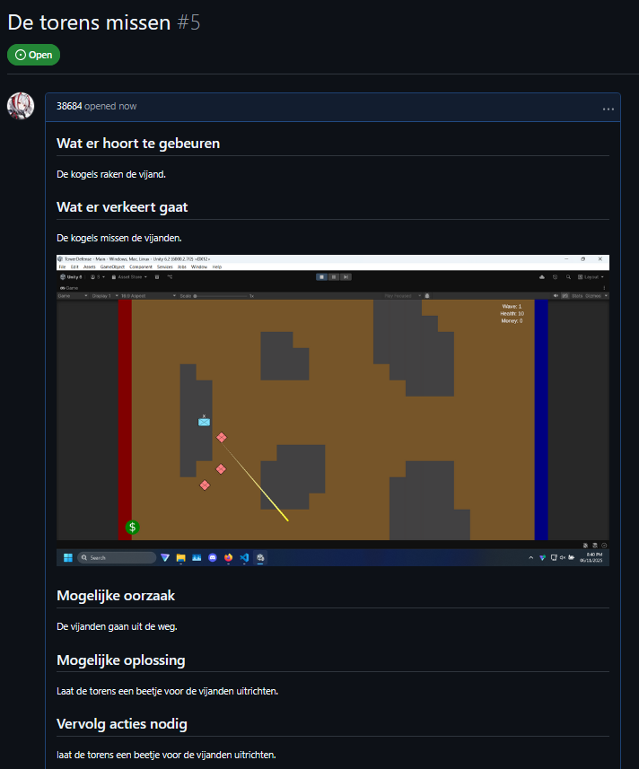

## PROG les 4: Single Responsibility (SRP) en Don't Repeat Yourself (DRY)

### Opdracht 6: SRP

Ik heb de schip script opgesplit.

[Github Link](https://github.com/38684/Space48)

### Opdracht 7: DRY

Ik heb de movement scripts gecombineerd en de message scripts gecombineerd.

[Github Link](https://github.com/38684/Space48)

## PROG les 5: OOP Inheritance

### Opdracht 8: Inheritance

Ik heb inheritance gebruikt.

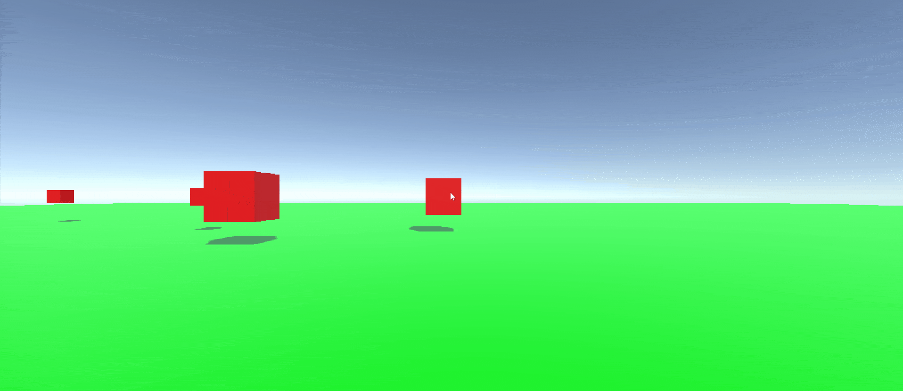

[Shoot From Camera Script](Prog/Assets/Scripts/M5Prog/05_OOP_Inherritance/ShootFromCamera.cs) \
[Projectile Script](Prog/Assets/Scripts/M5Prog/05_OOP_Inherritance/Projectile.cs) \
[Enemy Parent Script](Prog/Assets/Scripts/M5Prog/05_OOP_Inherritance/EnemyParent.cs) \
[Brute Script](Prog/Assets/Scripts/M5Prog/05_OOP_Inherritance/Brute.cs) \
[Elf Script](Prog/Assets/Scripts/M5Prog/05_OOP_Inherritance/Elf.cs)

### Opdracht 9: Encapsulation

Ik heb elke variable een voor een alle encapsulation veranderd

[PDF Link](Dependencies.pdf)
</details>

<details>

<summary>M6Prog</summary>

## Les 1 - Code Conventies in Unity

### Oefening 1 

```
public class GameManager : MonoBehaviour
{
    public bool isPlayerDead;
    public Int HP;
    private float jumpPower;
}
```

### Oefening 2

```
public class BaseEnemy : Monobehaviour
{
    [SerializeField] float speed = 9;
    [SerializeField] int health = 100;

    void TakeDamage(int damage)
    {
        health -= damage;
    }

    float CalculateRange(float modifier)
    {
        return range
    }
}

public class Enemy : BaseEnemy
{
    [SerializeField] GameObject player;
    [SerializeField] float attackRange = 2f;

    void Attack()
    {
        // Attack logic
    }

    void OnTriggerEnter(Collision other)
    {
        if(other.CompareTag("Trap"))
        {
            TakeDamage(50);
        }
    }

    void Update()
    {
        if (Distance(gameObject.transform,position, player.transform.position) > CalculateRange(speed/5)
        {
            Attack();
        }
    }
    
}

```

### Opdracht 1

Ik heb een inventory systeem gemaakt volgen de conventies.

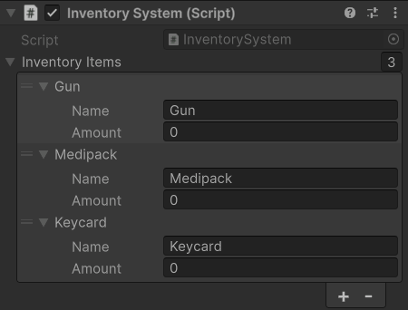

[Inventory System Script](Prog/Assets/Scripts/M6Prog/01_Code_Conventions/InventorySystem.cs) \
[Inventory Item Script](Prog/Assets/Scripts/M6Prog/01_Code_Conventions/InventoryItem.cs)


## PROG les 7: Class Diagrams

### Opdracht 10: Class Diagram van je TD project

Ik heb een class diagram van de TD project in mermaid gemaakt.

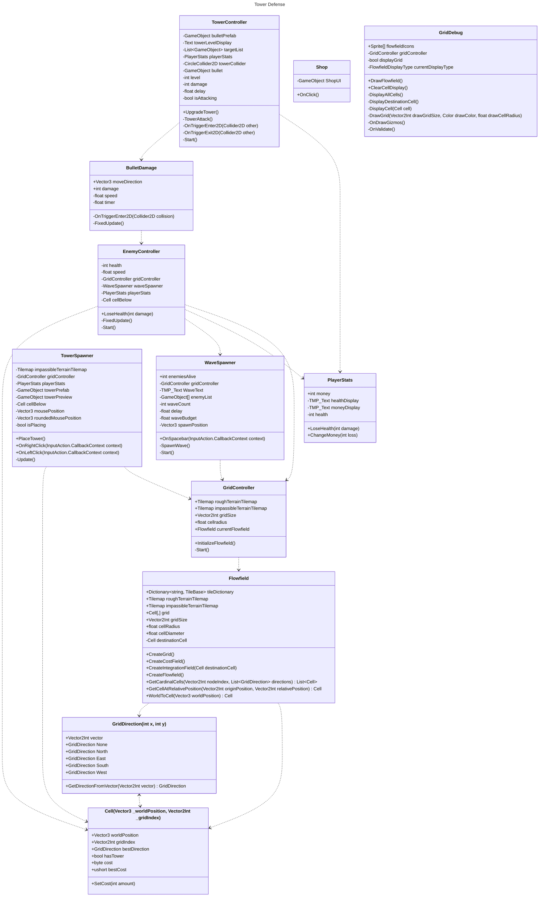
```mermaid

---
title: Tower Defense
---
classDiagram

    Flowfield ..> Cell
    Flowfield ..> GridDirection
    GridController ..> Flowfield
    TowerController ..> PlayerStats
    TowerController ..> BulletDamage
    TowerSpawner ..> GridController
    TowerSpawner ..> Cell
    BulletDamage ..> EnemyController
    EnemyController ..> GridController
    EnemyController ..> PlayerStats
    EnemyController ..> WaveSpawner
    EnemyController ..> Cell
    WaveSpawner ..> GridController
    GridDirection <..> Cell

    class Flowfield {
        +Dictionary~string, TileBase~ tileDictionary
        +Tilemap roughTerrainTilemap
        +Tilemap impassibleTerrainTilemap
        +Cell[,] grid
        +Vector2Int gridSize
        +float cellRadius
        +float cellDiameter
        -Cell destinationCell

        +CreateGrid()
        +CreateCostField()
        +CreateIntegrationField(Cell destinationCell)
        +CreateFlowfield()
        +GetCardinalCells(Vector2Int nodeIndex, List~GridDirection~ directions) List~Cell~
        +GetCellAtRelativePosition(Vector2Int originPosition, Vector2Int relativePosition) Cell
        +WorldToCell(Vector3 worldPosition) Cell
    }

    class GridController {
        +Tilemap roughTerrainTilemap
        +Tilemap impassibleTerrainTilemap
        +Vector2Int gridSize
        +float cellradius
        +Flowfield currentFlowfield

        +InitializeFlowfield()
        -Start()
    }

    class PlayerStats {
        +int money
        -TMP_Text healthDisplay
        -TMP_Text moneyDisplay
        -int health

        +LoseHealth(int damage)
        +ChangeMoney(int loss)
    }

    class Shop {
        -GameObject ShopUI

        +OnClick()
    }

    class TowerController {
        -GameObject bulletPrefab 
        -Text towerLevelDisplay 
        -List~GameObject~ targetList
        -PlayerStats playerStats 
        -CircleCollider2D towerCollider 
        -GameObject bullet 
        -int level
        -int damage
        -float delay
        -bool isAttacking

        +UpgradeTower()
        -TowerAttack()
        -OnTriggerEnter2D(Collider2D other)
        -OnTriggerExit2D(Collider2D other)
        -Start()
    }
    
    class TowerSpawner {
        -Tilemap impassibleTerrainTilemap
        -GridController gridController
        -PlayerStats playerStats
        -GameObject towerPrefab
        -GameObject towerPreview
        -Cell cellBelow
        -Vector3 mousePosition
        -Vector3 roundedMousePosition
        -bool isPlacing

        +PlaceTower()
        +OnRightClick(InputAction.CallbackContext context)
        +OnLeftClick(InputAction.CallbackContext context)
        -Update()
    }

    class BulletDamage {
        +Vector3 moveDirection
        +int damage
        -float speed
        -float timer

        -OnTriggerEnter2D(Collider2D collision)
        -FixedUpdate()
    }

    class EnemyController {
        -int health
        -float speed
        -GridController gridController
        -WaveSpawner waveSpawner
        -PlayerStats playerStats
        -Cell cellBelow

        +LoseHealth(int damage)
        -FixedUpdate()
        -Start()    
    }

    class WaveSpawner {
        +int enemiesAlive
        -GridController gridController
        -TMP_Text WaveText
        -GameObject[] enemyList
        -int waveCount
        -float delay
        -float waveBudget
        -Vector3 spawnPosition

        +OnSpacebar(InputAction.CallbackContext context)
        -SpawnWave()
        -Start()
    }

    class Cell["Cell(Vector3 _worldPosition, Vector2Int _gridIndex)"] {
        +Vector3 worldPosition
        +Vector2Int gridIndex
        +GridDirection bestDirection
        +bool hasTower
        +byte cost
        +ushort bestCost

        +SetCost(int amount)
    }

    class GridDirection["GridDirection(int x, int y)"] {
        +Vector2Int vector
        +GridDirection None
        +GridDirection North
        +GridDirection East
        +GridDirection South
        +GridDirection West

        +GetDirectionFromVector(Vector2Int vector) GridDirection
    }

    class GridDebug {
        +Sprite[] flowfieldIcons
        -GridController gridController
        -bool displayGrid
        -FlowfieldDisplayType currentDisplayType

        +DrawFlowfield()
        +ClearCellDisplay()
        -DisplayAllCells()
        -DisplayDestinationCell()
        -DisplayCell(Cell cell)
        -DrawGrid(Vector2Int drawGridSize, Color drawColor, float drawCellRadius)
        -OnDrawGizmos()
        -OnValidate()
    }
```
[TowerDefense Repository](https://github.com/38684/TowerDefense)


## Les 3 - Data Structures in Unity

### Oefening 1

1. Bool
2. MonoBehaviour
3. Vector3
4. Struct

### Oefening 2

```
public class Enemy : MonoBehaviour {
    public bool enemyType;

    public struct Stats {
        public float health;
        public float damage;
        public float speed;
    }
}
```


### Opdracht 3: Inventory & Item Management System

Ik heb data structuren gebruikt om een inventory te maken.

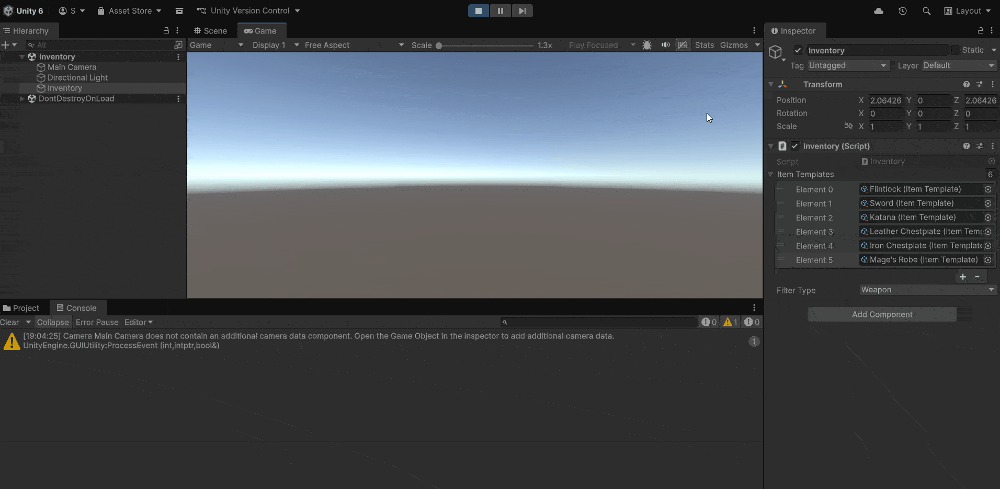

[Inventory Script](Prog/Assets/Scripts/M6Prog/03_Data_Structures/Inventory.cs) \
[Item Script](Prog/Assets/Scripts/M6Prog/03_Data_Structures/Item.cs) \
[Item Stats Script](Prog/Assets/Scripts/M6Prog/03_Data_Structures/ItemStats.cs) \
[Item Template Script](Prog/Assets/Scripts/M6Prog/03_Data_Structures/ItemTemplate.cs) \
[Item Type Script](Prog/Assets/Scripts/M6Prog/03_Data_Structures/ItemType.cs)

</details>